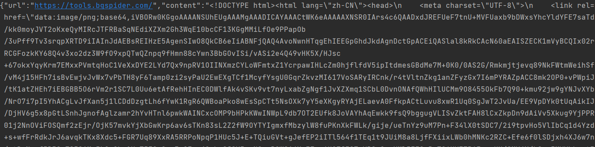

# 分布式渲染服务使用说明
- 安装依赖环境 pip install -r requirements.txt
- 服务启动命令 python server.py
- 渲染服务启动程序 python consumption_dp.py  

想要启动分布式的情况下，每个服务器都可以启动一次'python consumption_dp.py'

# 测试
可以尝试运行“测试渲染接口.py”的文件
如图所示，说明可以正常运行

